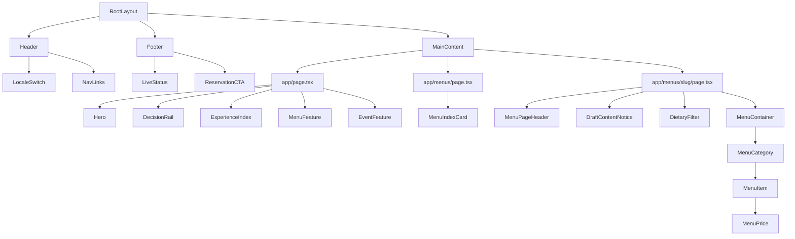
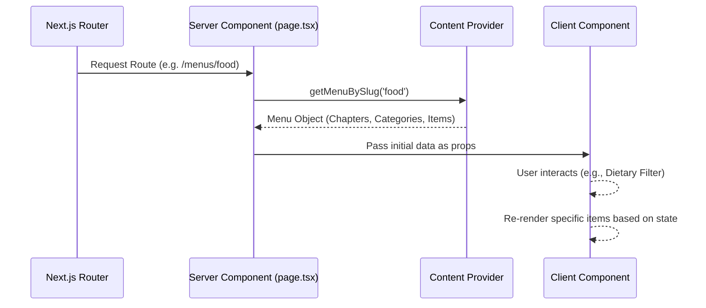

# Project Architecture

This document provides a visual and structural overview of the One 8 Restobar codebase to help developers understand data flow, component hierarchies, and content governance.

## Component Tree

## Data Flow

The application uses Next.js Server Components by default. Data is fetched on the server at build time (SSG) or request time (SSR) using the internal CMS module, then passed down as props to components.

## Content Governance

Menu content is strictly typed and managed in `src/lib/cms/`. We enforce a strict governance model to prevent unapproved placeholder content from reaching production.

- `source-draft`: Content ported from legacy documents but lacking client approval. In development, this renders with a `[Name review required]` badge. In production, these items are **stripped out entirely**.
- `client-approved`: Verified content that is safe for production deployment.

## Design System

We use plain CSS Modules (`.module.css`) combined with CSS Variables for the design system.

- **Tokens**: Located in `src/app/globals.css` (Colors, Typography, Spacing, Animation).
- **Typography**: Next.js optimized fonts (Geist Sans, Geist Mono). Fallbacks to system UI fonts.
- **Responsive**: 4 core viewports (320px, 768px, 1024px, 1920px).

## Testing Strategy

End-to-end and accessibility testing is powered by **Playwright** and **Axe**.

- `tests/menus.spec.ts`: Validates routing, rendering, and conditional unpublished states.
- `tests/accessibility.spec.ts`: Injects Axe to verify WCAG 2.2 AA compliance across all routes and interactive elements.
